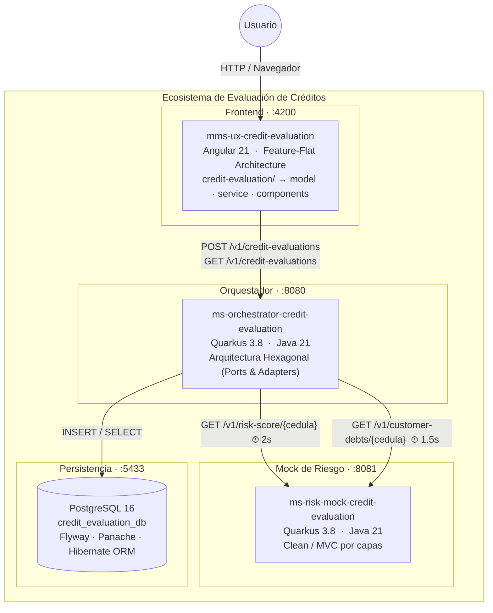
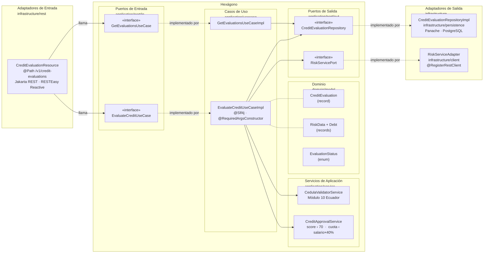
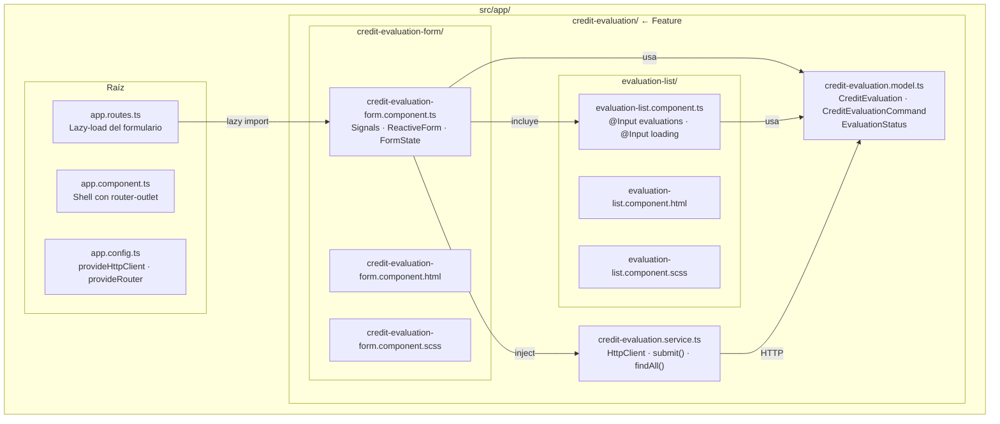
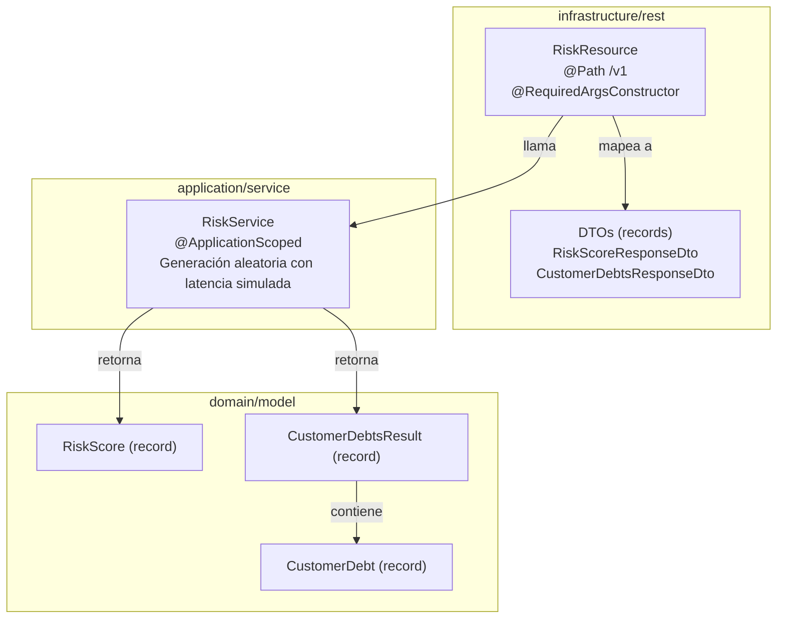
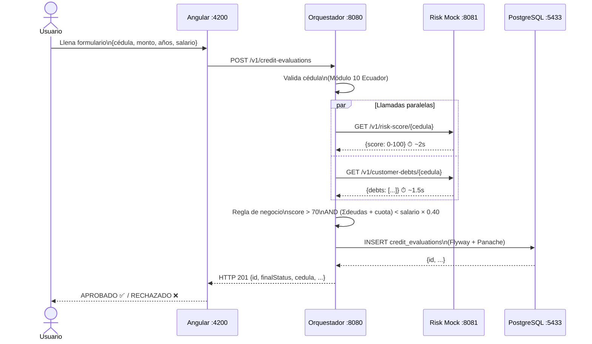

# Ecosistema de Evaluación de Créditos — PoC

Sistema completo para la evaluación y gestión de solicitudes de crédito, compuesto por tres proyectos independientes con arquitecturas bien definidas.

---

## Estructura del Ecosistema

```
austro/
├── mms-ux-credit-evaluation/           # Frontend Angular 21 — Feature-Flat Architecture
├── ms-orchestrator-credit-evaluation/  # Quarkus 3.8 — Arquitectura Hexagonal + PostgreSQL
├── ms-risk-mock-credit-evaluation/     # Quarkus 3.8 — Clean/MVC (mock de bureau de crédito)
└── docker-compose.yml                  # Orquestación completa del ecosistema
```

---

## Diagramas de Arquitectura

### 1. Vista General del Ecosistema



---

### 2. Arquitectura Hexagonal — ms-orchestrator-credit-evaluation



---

### 3. Arquitectura Feature-Flat — mms-ux-credit-evaluation



---

### 4. Arquitectura por Capas — ms-risk-mock-credit-evaluation



---

### 4. Secuencia — Flujo Completo de Evaluación



---

## Descripción de los Componentes

### `mms-ux-credit-evaluation` — Frontend Angular 21
**Arquitectura:** Feature-Flat — todo bajo `credit-evaluation/` sin capas intermedias
- `credit-evaluation.model.ts` — interfaces y tipos puros
- `credit-evaluation.service.ts` — HttpClient directo, `submit()` y `findAll()`
- Formulario con validaciones reactivas (cédula 10 dígitos, montos positivos)
- Estado manejado con Angular Signals (`idle | loading | success | error`)
- Visualización del resultado: APROBADO (verde) / RECHAZADO (rojo)
- Historial de evaluaciones en tabla con lazy-load al iniciar
- Puerto: `http://localhost:4200`

### `ms-orchestrator-credit-evaluation` — Microservicio Orquestador
**Arquitectura:** Hexagonal (Puertos y Adaptadores)
- Valida la cédula con algoritmo Módulo 10 de Ecuador
- Consulta en paralelo el score y las deudas al servicio de riesgo
- Aplica la regla de negocio de aprobación
- Persiste el resultado en PostgreSQL con Flyway + Panache
- Puerto: `http://localhost:8080`

### `ms-risk-mock-credit-evaluation` — Mock de Servicio de Riesgo
**Arquitectura:** Clean/MVC por capas
- Genera scores aleatorios (0-100) con latencia de 2 segundos
- Genera deudas aleatorias (0-3) con latencia de 1.5 segundos
- Puerto: `http://localhost:8081`

---

## Inicio Rápido (Docker Compose)

### Prerrequisitos
- Docker 24+
- Docker Compose v2+

### 1. Compilar los microservicios Quarkus
```bash
# Microservicio de riesgos
cd ms-risk-mock-credit-evaluation
./mvnw package -DskipTests
cd ..

# Microservicio orquestador
cd ms-orchestrator-credit-evaluation
./mvnw package -DskipTests
cd ..
```

### 2. Levantar el ecosistema completo
```bash
docker-compose up --build
```

Los servicios se inician en este orden (gestionado por `depends_on` + healthchecks):
1. PostgreSQL
2. ms-risk-mock-credit-evaluation
3. ms-orchestrator-credit-evaluation
4. mms-ux-credit-evaluation

### 3. Acceder a los servicios
| Servicio | URL |
|---|---|
| Frontend Angular | http://localhost:4200 |
| API Orquestador | http://localhost:8080 |
| Swagger Orquestador | http://localhost:8080/swagger-ui |
| API Mock de Riesgo | http://localhost:8081 |
| Swagger Mock de Riesgo | http://localhost:8081/swagger-ui |

---

## Inicio en Modo Desarrollo (sin Docker)

### PostgreSQL local
```bash
# Opción rápida: usar el compose dedicado (recomendado si ya tienes otro PostgreSQL en :5432)
docker compose -f docker-compose.db.yml up -d

# Opción alternativa: contenedor manual
docker run --name credit-postgres \
  -e POSTGRES_DB=credit_evaluation_db \
  -e POSTGRES_USER=austro_user \
  -e POSTGRES_PASSWORD=austro_pass \
  -p 5433:5432 -d postgres:16
```

### Microservicio de Riesgos (terminal 1)
```bash
cd ms-risk-mock-credit-evaluation
./mvnw quarkus:dev
```

### Microservicio Orquestador (terminal 2)
```bash
cd ms-orchestrator-credit-evaluation
./mvnw quarkus:dev
```

### Frontend Angular (terminal 3)
```bash
cd mms-ux-credit-evaluation
npm install
npm start
```

---

## Ejecutar Tests

### Orquestador — Tests unitarios y de integración
```bash
cd ms-orchestrator-credit-evaluation
./mvnw test
```

### Mock de Riesgos — Tests de integración
```bash
cd ms-risk-mock-credit-evaluation
./mvnw test
```

---

## Flujo de una Evaluación

```
Usuario (Angular Form)
  │ POST /v1/credit-evaluations
  ▼
ms-orchestrator (puerto 8080)
  ├── Valida cédula (Módulo 10 Ecuador)
  ├── GET /v1/risk-score/{cedula}  ──────► ms-risk-mock (latencia 2s)
  ├── GET /v1/customer-debts/{cedula} ───► ms-risk-mock (latencia 1.5s)
  ├── Aplica regla de negocio:
  │     score > 70 AND (deudas + cuota) < (salario * 0.40)
  └── Persiste en PostgreSQL
        │ HTTP 201 {finalStatus, id, ...}
        ▼
Usuario ve: ✅ APROBADO | ❌ RECHAZADO
```

---

## Regla de Negocio

```
APROBADO si:
  score > 70
  AND
  (Σ deudas_mensuales + (monto_solicitado / (años × 12))) < (salario × 0.40)

RECHAZADO en cualquier otro caso.
```

---

## Stack Tecnológico

| Componente | Tecnología | Versión |
|---|---|---|
| Frontend | Angular + TypeScript | 21.2 / TS 5.9 |
| Microservicio A | Quarkus + Java | 3.8.4 / Java 21 |
| Microservicio B | Quarkus + Java | 3.8.4 / Java 21 |
| Base de Datos | PostgreSQL | 16 |
| Comunicación intra-servicio | MicroProfile REST Client | Quarkus built-in |
| Migraciones BD | Flyway | Quarkus built-in |
| ORM | Hibernate ORM + Panache | Quarkus built-in |
| Testing BE | JUnit 5 + RestAssured + WireMock | — |
| Contenedores | Docker + Docker Compose | 24+ |
